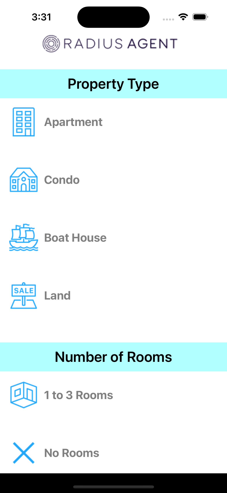

# Radius Agent Assignment

 
 

### Introduction

This is an assignment for creating a UI for
filtering out different real estate entities including
flats, apartments, land etc.

### Tech stack and architecture

This was made using Swift language for consumption in iOS
based devices. The project uses **VIPER** Architecture for
structuring various working components of the UI and
facilitating state management.

### Libraries used

The project uses **SnapKit** for layouting different UI 
elements on the screen